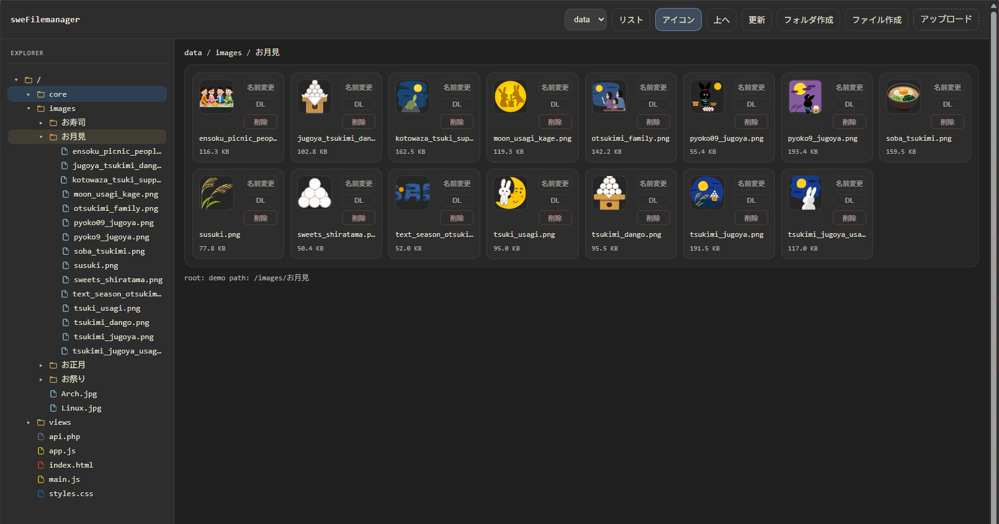

# sweFilemanager

ブラウザで動作するリモート・ファイルマネージャです。



## Live Demo
[こちらで動作確認ができます](https://swefilemanager-production.up.railway.app)
<br><br>

- UI: VS Code 風 Explorer（左ツリー + 任意の右コンテンツ領域）
- Backend: PHP（`public/api.php`）
- Frontend: ES Modules（`public/main.js`）

## 動作要件

- 静的ファイル配信と PHP 実行ができる Web サーバ（例: nginx + php-fpm）

## 配置 / 起動

このディレクトリを Web ルート配下に配置してください。

URL 例:

- `https://<host>/filemanager/`
- `https://<host>/filemanager/public/`

フロントエンドは asset/API URL を相対解決するため、サブパス配下でも動作します。

## 操作ルート（閲覧/編集できる範囲）

操作ルートはプロジェクト直下の `config.json` で設定します。

例:

```json
{
  "defaultRoot": "demo",
  "content": true,
  "roots": {
    "demo": {
      "label": "web",
      "path": "../"
    }
  }
}
```

- `roots` のキー（例: `demo`）が API の `root` パラメータとして使われます。
- `defaultRoot` は `roots` のキーのいずれかと一致している必要があります。
- `label` は UI 表示用です。
- `path` は以下を指定できます。
  - 絶対パス: `/var/www/web/shared`
  - 相対パス: `public/api.php`（PHP 側）から `__DIR__ . '/../' . path` として解決されます。

### 右コンテンツ領域の表示切替

`content` で右側コンテンツ領域（`.swefm-content`）の表示/非表示を切り替えられます。

- `true`（デフォルト）: 右コンテンツ領域を表示
- `false`: 右コンテンツ領域を非表示にし、左ツリー中心の UI にします

### 権限（Permissions）

PHP プロセスの実行ユーザが、選択したルートに対して読み書き権限を持っている必要があります。

以下のようなエラーが出る場合:

- `mkdir(): Permission denied`
- `fopen(...): Permission denied`

OS/Docker ボリュームの権限を修正するか、書き込み可能なルートを選択してください。

## UI の使い方

### 作成（フォルダ/ファイル）

作成はインライン入力です（`prompt()` は使いません）。

- `フォルダ作成` / `ファイル作成` をクリック
- 入力欄が表示されます
- `Enter` で確定
- `Esc`（またはフォーカスアウト）でキャンセル

### リネーム

- `名前変更` をクリック
- ファイル名がインライン入力になります
- `Enter` で確定
- `Esc`（またはフォーカスアウト）でキャンセル

### 左ツリー（Explorer）

- フォルダ/ファイルを表示します。
- フォルダ: 展開/折りたたみ、クリックで移動。
- ファイル: ダブルクリックで open-file フックを呼び出します（ダウンロードのフォールバックはありません）。
- 作成/アップロード/削除/リネーム後にツリーキャッシュを更新するため、変更が即時反映されます。

### 右ペイン（リスト/アイコン）

- 表示は `リスト` / `アイコン` を切り替えられます。
- 表示モードはディレクトリ単位で永続化されます（Cookie）。

### 複数選択

- `Ctrl`/`Cmd` + クリック: トグル選択
- `Shift` + クリック: 範囲選択

### コピー/切り取り/貼り付け（クリップボード）

右ペインでは以下が使えます。

- `Ctrl`/`Cmd` + `C`: copy
- `Ctrl`/`Cmd` + `X`: cut
- `Ctrl`/`Cmd` + `V`: paste

右クリックメニューからも copy/cut/paste が可能です。

### ドラッグ&ドロップ

- 右ペイン -> 右ペイン/左ツリー へドラッグして移動できます。
- `Ctrl`/`Cmd` を押しながらドロップするとコピーになります。
- DnD 中にフォルダへ一定時間ホバーすると自動で開く/展開します。

### アップロード（モーダル）

ヘッダーの `アップロード` をクリックすると、アップロード用モーダルが開きます。

できること:

- 複数ファイル選択によるアップロード（`ファイルを選ぶ`）
- ドロップゾーンへのドラッグ＆ドロップによるアップロード
- フォルダのドラッグ＆ドロップ（フォルダ配下のファイルを再帰的に列挙してアップロード）

アップロード中の表示:

- モーダル中央にスピナー（ぐるぐる）を表示します
- ドロップゾーン上に薄いログが表示され、上に流れてフェードアウトします（大まかな進捗の目安）

モーダルを閉じる:

- `閉じる` ボタン
- 背景クリック
- `Esc`

制約/注意:

- フォルダのドラッグ＆ドロップは、ブラウザが `webkitGetAsEntry` をサポートしている必要があります（主に Chrome / Edge 系）
- 空フォルダ（中にファイルが1つもないフォルダ）はアップロード対象が無いため作成できません
- 複数ファイルのみのドラッグ＆ドロップは `DataTransfer.files` を利用し、安定して全件取得できるようにしています

### エディタ連携フック

右側の領域に任意のエディタを埋め込めるようにすることを前提にしています。

フックは任意のグローバル関数です。存在する場合に UI が呼び出します。

#### Open file (tree double-click)

定義例:

```js
window.sweFilemanagerOnOpenFile = ({ root, path, name, downloadUrl }) => {
  // ここでエディタに読み込んでください。
  // 戻り値は UI 側で利用しません（ダウンロードは常に無効です）。
};
```

引数:

- `root`: root キー
- `path`: ルートからの相対パス
- `name`: ファイル名
- `downloadUrl`: `fetch()` でファイルを取得できる URL

#### Tree selection

ツリーの選択変更は常にブラウザの console にログ出力されます。

必要なら以下も定義できます:

```js
window.sweFilemanagerOnSelectTree = ({ root, paths, primaryPath }) => {
  // 選択変更に反応したい場合に使います（例: エディタのタブ更新など）
};
```

引数:

- `root`: root キー
- `paths`: 選択中パス（複数選択）
- `primaryPath`: 先頭の選択パス

## ファイルタイプ別アイコン

アイコンは設定に応じて `` で表示できます（推奨）。

設定が無い場合は、従来どおり CSS の `mask` を使ったアイコン（`span.icon`）にフォールバックします。

### `config.json` で画像アイコンを設定する

`config.json` のトップレベルに `icons` を追加します。

```json
{
  "defaultRoot": "demo",
  "content": true,
  "icons": {
    "folder": "./public/icons/folder.png",
    "file": "./public/icons/file.png",
    "ext": {
      "js": "./public/icons/js.png",
      "ts": "./public/icons/ts.png",
      "json": "./public/icons/json.png",
      "md": "./public/icons/md.png"
    }
  },
  "roots": {
    "demo": {
      "label": "web",
      "path": "../"
    }
  }
}
```

仕様:

- `icons.folder`: フォルダ用アイコン URL
- `icons.file`: デフォルトのファイル用アイコン URL
- `icons.ext`: 拡張子ごとの上書き（キーは `js` のようにドット無し、小文字推奨）

注意:

- URL は `index.html` から参照できるパスにしてください（同一オリジンの静的ファイル推奨）。
- `icons` を設定していない場合や URL が空の場合は、CSS アイコン表示になります。

## API

### サーバー側は各自でご用意いただく前提で、サンプルとしてこちらを用意しました。

エンドポイント:

- `public/api.php?action=...`

アクション:

- `config` (GET)
- `list` (GET)
- `stat` (GET)
- `mkdir` (POST JSON)
- `touch` (POST JSON)
- `rename` (POST JSON)
- `delete` (POST JSON)
- `move` (POST JSON)
- `copy` (POST JSON)
- `upload` (POST multipart/form-data)
- `download` (GET)

### CSRF

書き込み系 API（`mkdir/touch/rename/delete/move/copy/upload`）は CSRF 保護されています。

- JSON レスポンスには `csrftk` が含まれます
- フロントエンドはトークンを保持し、次回以降 `X-CSRF-Token` ヘッダで送信します

サーバが返したトークンと一致しない場合は `403` になります。

## Node での簡易起動（開発用）

PHP 実行環境がない場合、Node の簡易サーバ（`server.js`）でも動作確認できます。

```bash
npm install
npm run dev
```

- デフォルト: `http://localhost:5173/`
- 操作ルート: 環境変数 `FILE_ROOT`（未指定なら `./data`）

### AJAX レスポンス

多くの API 呼び出しは JSON を返します。

- 成功: `{ "ok": true }` や `{ "entries": [...] }` のような JSON
- 失敗: `{ "error": "..." }` のような JSON（HTTP ステータスも適切に返します）

例外:

- PHP が JSON を返す前に致命的エラーで落ちた場合、レスポンスが HTML/text になることがあります。
  その場合でもフロントエンドはレスポンス本文をエラーメッセージとして表示します。

### download は JSON ではありません

`download` はブラウザをダウンロード URL に遷移させて取得するため、ファイルのバイト列が返ります（JSON ではありません）。


<br><br>

## 免責
```md
本リポジトリのソースコードは MIT ライセンスです。
基本的に自由に利用できますが、詳細は各ソースファイル内のコメントをご確認ください。